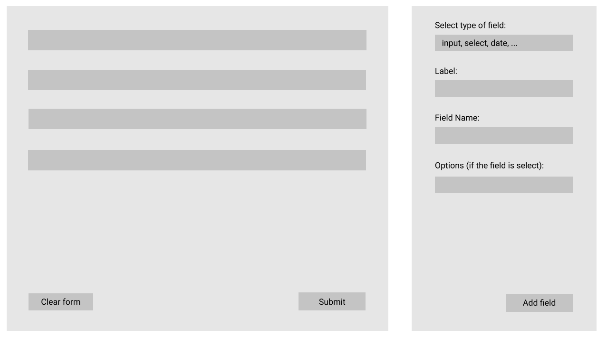

# Landbell Challenge
**Frontend developer recruitment.**

### Overview

There is a VueJS challenge, you can use the proposed layout below or proposed a new one.
 
[]

**Business rules**

 - To add a field, the user must first choose the field type and then the properties (label, field name, options, etc);
 - When the user clicks on Add Field, it should reflect on the form on the left side and reset the setting on the right side;
 - The form must persist when the user refreshes the page or leaves the page;
 - When clicking submit, log to the console an object of the form, the key being the "Field Name" and the value the user input (output example below);

```json
{
   "name":"John Doe",
   "age":"27",
   "address":"Street name"
}
```
---

### What we look for
This task is designed to give us an idea of how you approach programming problems.

We will look at how you structure the page in components, as well as the structure of your code.

We are looking at how well you understand vue and it's concepts.

---

### Requirements
 - Use Vue 2 and Vue-CLI.
 - Use javascript libraries if you wish.
 - Include a short documentation of ***how to install***.
 
---

### How to apply
 -  Must be done by GitHub, GitLab or ***BitBucket (recommended)***
 -  When finished, send the link or ask to add members (BitBucket: n.costa@landbellgroup.com; t.hessel@landbellgroup.com; j.moreira@landbellgroup.com)
 
 
 We look forward to seeing your work =)